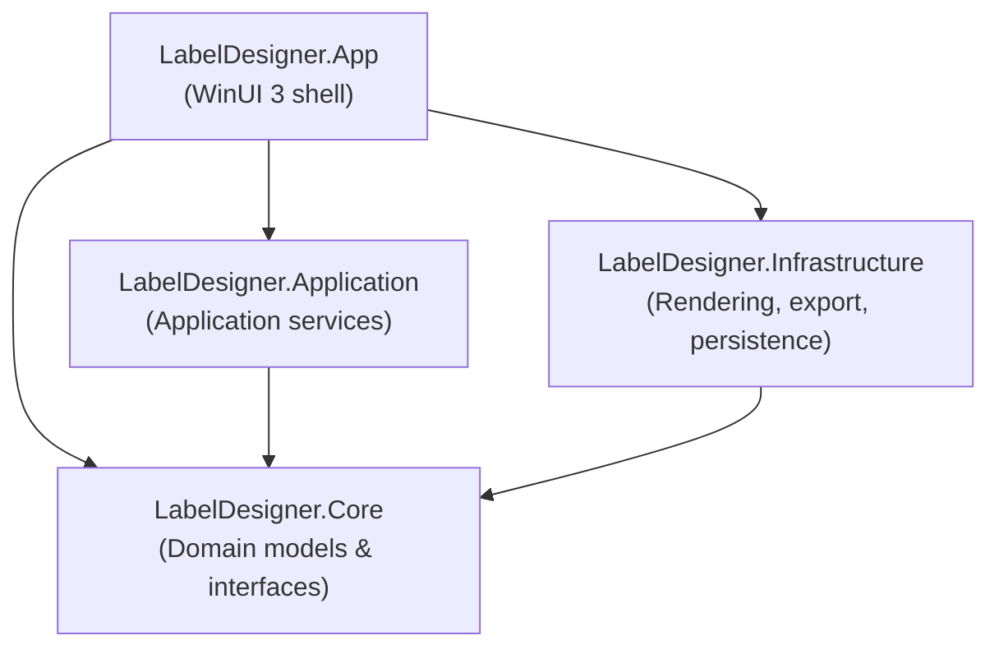

<!-- generated-by: gsd-doc-writer -->
# LabelDesigner — Architecture

## System overview

LabelDesigner is a WinUI 3 desktop application that allows users to design, preview, and print barcode labels on Windows. It follows a layered architecture with a strict dependency rule: outer layers depend inward, never the reverse. The UI layer (`App`) consumes `Application` services, which operate on `Core` domain models; `Infrastructure` implements the `Core` interfaces using platform-specific technology (Win2D, SkiaSharp, ZXing.Net). A shared draw-command pipeline is the central seam that lets canvas preview, print, PDF export, and PNG export share one rendering path.

---

## Component diagram



Data flow through a typical edit operation:

```
User gesture (pointer)
  → DesignerCanvasView (WinUI / Win2D)
  → DesignerViewModel (CommunityToolkit.Mvvm)
  → ISceneGraphService / IElementInteractionService (Application)
  → SceneDocument mutation via IUndoableCommand
  → IRenderService draws DrawCommands to CanvasDrawingSession
  → Canvas invalidated → repaint
```

---

## Directory structure

```
LabelDesigner.slnx                   Solution file
│
├── LabelDesigner.Core/              Domain — no UI, no platform code
│   ├── Models/                      SceneDocument, DesignElement subtypes, LayerNode
│   ├── Interfaces/                  Service contracts (ISceneGraphService, IUndoRedoService, …)
│   ├── ValueObjects/                RectD, PointD
│   ├── Enums/                       BarcodeSymbology, ResizeHandle, PageSize, …
│   ├── Rendering/                   DrawCommand types (shared render seam)
│   └── Utilities/                   Pure helpers
│
├── LabelDesigner.Application/       Orchestration — implements Core interfaces
│   ├── Commands/                    UndoRedoService + IUndoableCommand implementations
│   ├── Services/                    SceneGraphService, ElementInteractionService,
│   │                                SnapService, DataBindingService, …
│   └── Data/                        CSV data-source wrappers
│
├── LabelDesigner.Infrastructure/    Platform — implements Core/Infrastructure interfaces
│   ├── Rendering/                   ElementRenderer (Win2D), RenderingService
│   ├── Export/                      PdfExportService (SkiaSharp), PrintService, SvgService
│   ├── Barcode/                     BarcodeService (ZXing.Net)
│   ├── Persistence/                 JsonLabelPersistenceService
│   ├── Data/                        CsvDataSourceService
│   └── Interfaces/                  IRenderService, IDocumentRasterizer, IBarcodeService
│
├── LabelDesigner.App/               WinUI 3 shell
│   ├── ViewModels/                  DesignerViewModel, PropertiesViewModel,
│   │                                LayerPanelViewModel, RibbonViewModel, …
│   ├── Views/                       DesignerCanvasView, PropertiesPaneView,
│   │                                LayersPaneView, DataMergePaneView, SettingsPage
│   ├── Controls/                    RibbonControl, RulerControl
│   ├── Converters/                  Value converters for XAML bindings
│   └── Services/                    AppSettingsService, DpiService
│
└── LabelDesigner.Tests/             xUnit test project
```

---

## Key abstractions

| Abstraction | Location | Responsibility |
|---|---|---|
| `SceneDocument` | `Core/Models/SceneDocument.cs` | Root model: page, layers, elements, guides, data-source config |
| `DesignElement` | `Core/Models/DesignElement.cs` | Abstract base for all canvas elements; owns `Bounds`, `Rotation`, hit-test |
| `ISceneGraphService` | `Core/Interfaces/ISceneGraphService.cs` | CRUD for elements and layers, selection, move/resize/rotate, z-ordering |
| `IUndoRedoService` / `IUndoableCommand` | `Core/Interfaces/IUndoRedoService.cs` | Command-pattern undo stack |
| `ILabelPersistenceService` | `Core/Interfaces/ILabelPersistenceService.cs` | JSON serialise/deserialise a `SceneDocument` |
| `IRenderService` | `Infrastructure/Interfaces/` | Emit `DrawCommand` list for any render target |
| `IElementInteractionService` | `Core/Interfaces/IElementInteractionService.cs` | Pointer-based interaction state machine (placement, drag, resize, rotate) |
| `IDataBindingService` | `Core/Interfaces/IDataBindingService.cs` | Bind element fields to CSV columns; merge-print expansion |
| `IPdfExportService` | `Core/Interfaces/IPdfExportService.cs` | Render `SceneDocument` to a PDF file via SkiaSharp |
| `IPrintService` | `Core/Interfaces/IPrintService.cs` | Send pages to Windows print spooler |
| `CanvasViewport` | `App/ViewModels/CanvasViewport.cs` | Zoom, pan offset, and page-origin-to-screen mapping; drives ruler labels |

---

## Data flow

### Rendering seam (ADR-0001)

Rather than painting directly, `IRenderService` produces a list of `DrawCommand` objects. Downstream consumers interpret these commands:

- **Canvas preview** — `DesignerCanvasView` feeds them to a Win2D `CanvasDrawingSession`.
- **Print** — `PrintService` feeds them to a rasterized Win2D device.
- **PDF export** — `PdfExportService` converts them to SkiaSharp draw calls.
- **PNG export** — `DocumentRasterizer` renders to a `CanvasRenderTarget` then saves to a stream.

### Coordinate system (ADR-0002)

All `DesignElement.Bounds` are stored in **screen pixels at actual device DPI** — not logical 96-DPI pixels.

```
canvas_pixels  = mm × PixelsPerMm
print scale    = printDpi / (PixelsPerMm × 25.4)
pdf points     = 72 / (PixelsPerMm × 25.4)
```

`DpiService.PixelsPerMm` is computed once at startup from `GetDpiForWindow(hwnd) / 25.4`. Every export path derives its scale factor from this value.

### Undo/redo

`IUndoableCommand` wraps mutations to `SceneDocument`. `IUndoRedoService` maintains an execute stack and a redo stack. All mutations that affect document state — add/remove element, move, resize, paste, property edit — must be routed through a command.

### Syncfusion ribbon (ADR-0003)

Syncfusion ribbon buttons cannot bind `AsyncRelayCommand`. All async ribbon actions use a sync `RelayCommand` wrapper (`_ = MethodAsync()`). Any method that opens UI before its first `await` must start with `await Task.Yield()`.

---

## Dependency injection

Services are registered in `App.xaml.cs → ConfigureServices()` using `Microsoft.Extensions.DependencyInjection`. All services are singletons. The DI container is exposed via `App.Services`.

| Interface | Implementation |
|---|---|
| `IUndoRedoService` | `Application.Commands.UndoRedoService` |
| `ISceneGraphService` | `Application.Services.SceneGraphService` |
| `ILabelPersistenceService` | `Infrastructure.Persistence.JsonLabelPersistenceService` |
| `IElementInteractionService` | `Application.Services.ElementInteractionService` |
| `ISnapService` | `Application.Services.SnapService` |
| `IDataBindingService` | `Application.Services.DataBindingService` |
| `IDataSourceService` | `Infrastructure.Data.CsvDataSourceService` |
| `ILabelStockPresetService` | `Application.Services.LabelStockPresetService` |
| `IBarcodeService` | `Infrastructure.Barcode.BarcodeService` |
| `IRenderService` | `Infrastructure.Rendering.RenderService` |
| `IPrintService` | `Infrastructure.Export.PrintService` |
| `IPdfExportService` | `Infrastructure.Export.PdfExportService` |
| `ISvgService` | `Infrastructure.Export.SvgService` |

---

## Related documents

- [`CONTEXT.md`](../CONTEXT.md) — Domain vocabulary and terminology
- [`docs/adr/0001-draw-command-rendering-seam.md`](adr/0001-draw-command-rendering-seam.md)
- [`docs/adr/0002-coordinate-system-and-dpi-scaling.md`](adr/0002-coordinate-system-and-dpi-scaling.md)
- [`docs/adr/0003-syncfusion-ribbon-async-reentrancy.md`](adr/0003-syncfusion-ribbon-async-reentrancy.md)
- [`docs/adr/0004-ruler-guides.md`](adr/0004-ruler-guides.md)
- [`docs/canvas-transform-hit-testing.md`](canvas-transform-hit-testing.md)
